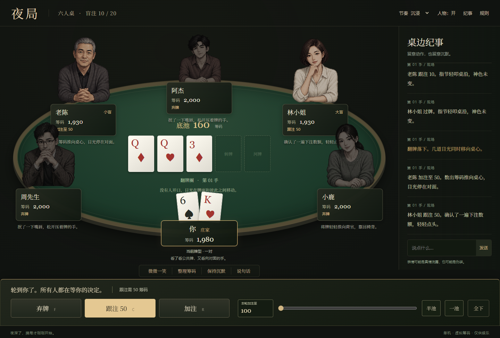

# 火星牌局 · Mars-3050

> **Alpha 验证版** · 当前可玩原型《夜局》 · 单机德州扑克 · 虚拟筹码

夜深了，六个人围坐在牌桌旁。有人轻轻敲着桌沿，有人把筹码重新码齐；一句话、一次停顿，都可能是试探，也可能只是伪装。你只有两张底牌，以及决定何时跟注、加注或离场的勇气。

《火星牌局》最终希望成为一款有角色、有氛围的牌桌游戏。现在的《夜局》是验证核心玩法与交互的 Alpha 版本：保留标准德州扑克的下注与结算规则，用人物姿态和文字纪事呈现牌桌上的紧张感。当前界面仍是夜间牌桌，火星主题会在后续迭代。



## 这一桌有什么

- **完整的一局**：你与五位电脑玩家各带 2,000 虚拟筹码入座，盲注 10 / 20；经过翻牌前、翻牌、转牌和河牌四轮下注，争夺主池与边池。
- **有性格的对手**：五位角色有不同的下注倾向。阿杰已有六种动作姿态；其他角色目前使用静态人物图。动作和桌边发言营造气氛，不是可靠的牌力提示。
- **用文字感受现场**：弃牌、推筹码、沉默和输赢反应写进桌边纪事。你也可以微笑、整理筹码、保持沉默，或说一句话；这些表达不会替你下注。
- **按自己的节奏玩**：轮到你时没有倒计时。可选沉浸、快速或慢速节奏，也能收起纪事、切换纯文字人物模式。
- **随时接着玩**：每手结算后自动保存筹码、庄位和手数；重新打开可从下一手继续。本次打开期间还能查看最近十手的文字回顾。

## 开始游戏

已在本机完成 Windows 构建时，双击项目根目录的 `夜局.exe`。仓库目前提供源码，尚未上传可下载的安装包。克隆仓库后也可以直接打开 `src/index.html`，或运行：

```bash
npm start
```

然后访问 `http://127.0.0.1:5173/`。桌面开发使用 `npm run dev`；运行 `npm run build` 会构建 Windows 客户端，并将最新版 `夜局.exe` 复制到项目根目录（需要 Rust 与 Tauri 构建环境）。

轮到你时可使用 **F** 弃牌、**C** 过牌或跟注、**R** 加注。加注可输入金额、拖动滑杆，或选半池/一池；全下需要再次确认。

这是使用虚拟筹码的单机游戏，不含真人联网、账号或真钱交易。进行中的一手不会存档，退出后回到上一手结算状态；最近十手回顾目前也不会跨重启保存。

开发验证可运行 `npm test`。后续方向见 [优化计划](OPTIMIZATION_PLAN.md)，人物素材见 [图集说明](src/assets/README.md)。
